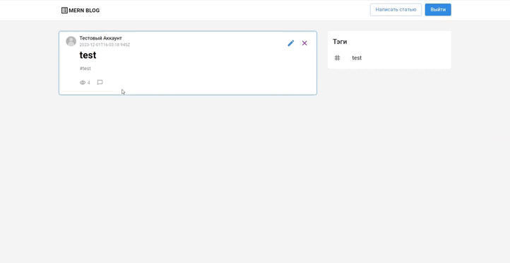

# Project Overview 🚀

This project encompasses a feature-rich application with the following key `functionalities`:

- **Registration**  
Effortlessly sign up for an account on the platform, providing necessary details to create a personalized user profile.

- **Authentication**  
Securely log in using your registered credentials, ensuring a protected and personalized user experience.

- **Post Management**  
Create, edit, and delete posts with ease. Enjoy the flexibility to craft and modify content, tailoring it to your preferences. This feature empowers users to actively contribute and manage their posts within the application.

# Preview 👀

## Tech Stack ⚙️

- **NodeJS:** Used for executing server-side JavaScript with support for ES6 modules.

- **Express:** Web server providing request handling and validation through the Validator library.

- **MongoDB / Mongoose:** Utilized for storing data in the MongoDB database, with interactions facilitated through the Mongoose library.

- **JSON Web Token (JWT):** Implemented for authentication and authorization. A unique web token is generated for each user.

- **Multer:** Library enabling the upload of files and images to the server.

- **BCrypt:** Employed for password encryption, preventing the storage of passwords in plain text.

## Running the Server 💻

In the project directory, you can run:

#### `npm run start:dev`

The backend is launched on the machine using the Express library.

## Data Storage 📂

User data is stored in the MongoDB database, including information about users, posts, and other entities supported by the project.

## File and Image Upload 📥

The Multer library is used to enable the upload of images and files to the server, enhancing the project's functionality by allowing users to interact with multimedia content.

## Password Encryption 🔒

To ensure security, user passwords are encrypted using the BCrypt library during registration.

## Authentication using JWT 🛡️

A unique JWT is generated for each user, which is used for authentication. The server verifies the validity of the token, and if the token is valid, authentication is considered successful.

**Note:** Additional information about backend functionality can be found in the [backend repository](link to the backend repository).

### Access the Project 📌

[Link to Deployed Website](https://mern-project-frontend-pi.vercel.app/)

For more details on the frontend functionality, please refer to the [Frontend Repository](https://github.com/antonoptimus/MERN_blog_frontend).

